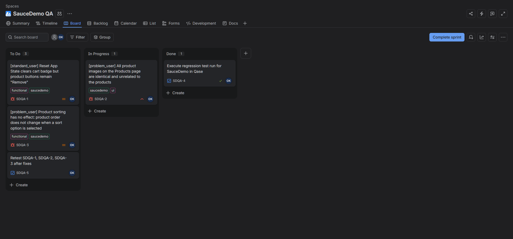
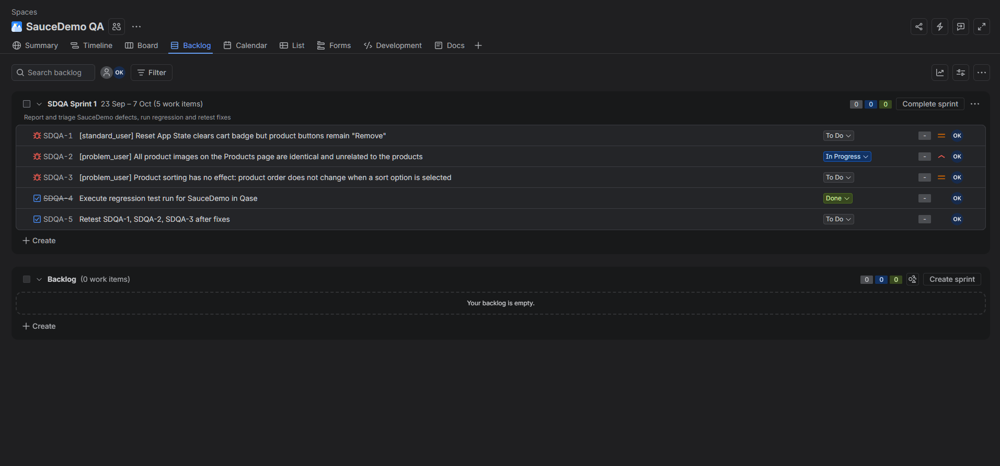
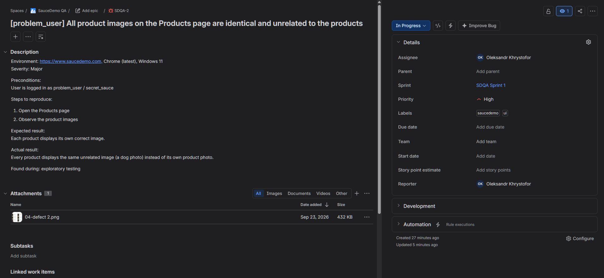

# SauceDemo — Manual Testing Project

Manual functional and exploratory testing of the [SauceDemo](https://www.saucedemo.com)
web store, managed in **Qase.io**. This project demonstrates the full manual
QA workflow: test planning, test case design, test execution and defect
reporting.

## About

- **Application under test:** SauceDemo (https://www.saucedemo.com)
- **Type of testing:** Manual, functional, exploratory (E2E)
- **Tools:** Qase.io (test management), Jira (bug tracking, Scrum board)
- **Tester:** Oleksandr Khrystofor

## What this project covers

- A **Test Plan** defining scope, approach, environment and entry/exit criteria
- **26 test cases** across 5 suites: Login, Products/Sorting, Cart, Checkout, Menu/Logout
- A structured **test run** (25 passed / 1 failed)
- An **exploratory session** under broken account (`problem_user`)
- **3 documented defects** with steps to reproduce, severity and screenshots
- **Bug tracking in Jira**: defects logged as Jira bugs and planned in a Scrum sprint

## Repository structure

```
QA-manual-testing-saucedemo/
├── evidence/               <- (Qase run dashboard, defect evidence, Jira screenshots)
├── README.md
├── defects.md
├── test-cases.csv          <- (exported from Qase)
├── test-plan.md            <- (Start here)
└── test-summary-report.md
```

## Results at a glance

| Metric | Value |
|--------|-------|
| Test cases | 26 |
| Passed | 25 |
| Failed | 1 |
| Defects logged | 3 (2 Major, 1 Minor) |

## Key defects

1. **All product images identical (problem_user)** — Major
2. **Sorting does not change product order (problem_user)** — Major
3. **Reset App State does not reset product buttons** — Minor

See `test-summary-report.md` for the full report.

## Bug tracking in Jira

The defects found in Qase were also logged in **Jira** (team-managed Scrum space
`SauceDemo QA`, key `SDQA`) to reproduce a real team workflow:

| Jira key | Type | Summary | Severity | Priority |
|----------|------|---------|----------|----------|
| SDQA-1 | Bug | Reset App State does not reset product buttons (standard_user) | Minor | Medium |
| SDQA-2 | Bug | All product images identical (problem_user) | Major | High |
| SDQA-3 | Bug | Sorting has no effect (problem_user) | Major | Medium |
| SDQA-4 | Task | Execute regression test run in Qase | — | — |
| SDQA-5 | Task | Retest SDQA-1..3 after fixes | — | — |

Each bug report contains environment, preconditions, steps to reproduce,
expected vs actual result, priority, labels and attached evidence (GIF/PNG).
All items were planned into a two-week sprint with a sprint goal and moved
across the board (To Do → In Progress → Done).

**Sprint board**



**Sprint backlog with sprint goal**



**Bug report example (SDQA-2)**



## Skills demonstrated

- Test case design (positive/negative, boundary cases)
- Defect reporting with clear, reproducible steps and severity/priority
- Exploratory testing
- Working in a test management system (Qase.io)
- Bug tracking and sprint planning in Jira (Scrum)
- Severity vs priority assessment
